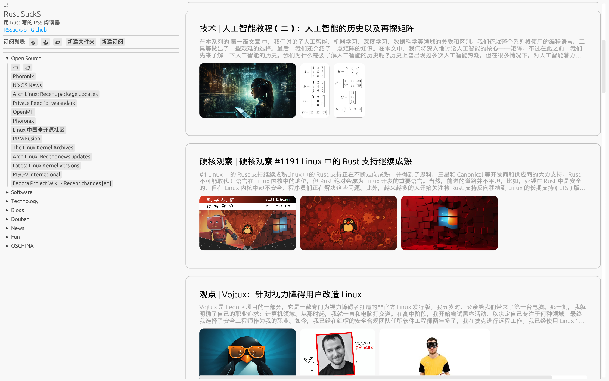

# RustSuckS

online demo: [click me](https://rssucks.weiyi.dev)

RustSuckS 是一个高性能、轻量级而且跨平台的 RSS 阅读器。

  
  

## 支持 / 计划支持的功能

- [x] 导入 / 导出 OPML 配置文件
- [x] HTML 网页渲染
- [x] 亮色 / 暗色模式
- [x] wasm 和网页部署
- [x] 缓存已拉取的文章
- [ ] 更好的 Log 输出
- [ ] 订阅列表显示网站图标
- [ ] 全局设置按钮
- [ ] 搜索页面
- [ ] 订阅 / 订阅文件夹重命名
- [ ] 在文件夹间移动订阅
- [ ] 分页功能 / 瀑布流
- [ ] 在订阅旁显示未读文章数量

## 安装

推荐从右侧的 [Github Release](https://github.com/vaaandark/RSSucks/releases) 下载对应平台的二进制文件。

也可以到 [GitHub Actions](https://github.com/vaaandark/RSSucks/actions?query=workflow%3A%22CI+build%22+actor%3Avaaandark+branch%3Amaster+event%3Apush+is%3Asuccess) 下载最新构建的二进制，包含 Linux 和 Windows 版本。

### 从源码编译

#### 编译到本地

确保正在使用最新版本的稳定 Rust，可以通过运行 `rustup update` 进行更新。

`cargo run --release`

在 Debian / Ubuntu 上，需要下载依赖：

`sudo apt-get install libxcb-render0-dev libxcb-shape0-dev libxcb-xfixes0-dev libxkbcommon-dev libssl-dev libgtk-3-dev libatk1.0-0 librust-atk-sys-dev`

在 Fedora 上，需要下载依赖：

`dnf install clang clang-devel clang-tools-extra libxkbcommon-devel pkg-config openssl-devel libxcb-devel gtk3-devel atk fontconfig-devel atk-devel rust-atk-devel`

#### 编译到本地 Web

可以将应用程序编译为[WebAssembly](https://en.wikipedia.org/wiki/WebAssembly)并发布为网页。

我们使用 [Trunk](https://trunkrs.dev/) 来构建 Web 目标。
1. 使用 `rustup target add wasm32-unknown-unknown` 安装所需的目标。
2. 使用 `cargo install --locked trunk` 安装 Trunk。
3. 运行 `trunk serve` 构建并在 `http://127.0.0.1:8080` 上提供服务。如果编辑项目，Trunk 将自动重新构建。
4. 在浏览器中打开 `http://127.0.0.1:8080/index.html#dev`。请参见下面的警告。

> `assets/sw.js` 脚本将尝试缓存我们的应用程序，并在无法连接到服务器时加载缓存的版本，使应用程序可以脱机工作（类似 PWA）。
> 在 `index.html` 后添加 `#dev` 将跳过此缓存，允许我们在开发期间加载最新的构建。

#### Web 部署

可以参考 [eframe_template](https://github.com/emilk/eframe_template) 。

> 本项目也基于它提供的模板，感谢 [emilk](https://github.com/emilk) 及其他 [egui](https://github.com/emilk/egui) 的维护者。
